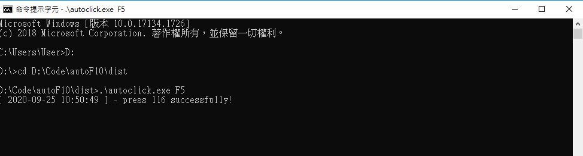

# Auto Click
This is a tool for automation clicking keyboard F1-F24.
This tool just for my friend requirement that clicking F10 to help her generate data for hour.

## Developer Run
##### Package `autoclick.py` to `exe` file for Windows OS environment.
Install `pyinstaller`
```
$ pip install pyinstaller
```
Run pyinstaller command to package your python file to `exe` file.

```
$ cd [your code path]
$ pyinstaller -F .\autoclick.py
```
copy `pythoncom38.dll` and `pywintypes38.dll` files from `lib` folder to as same `exe` file folder.

## User Run (Only Windows OS)
##### Default:
Open the tool is defult click `F10`.

##### Customize:
if you would like to change default key code - `F10`. you can follow do this bellow:
1. Open command line.
2. type `cd [replace your tool (exe file) path]` in your command line.
    - for example: my exe file path is `D:\Code\autoF10\dist` then type `cd D:\Code\autoF10\dist`.
3. type `.\autoclick.exe F3` is mean auto click `F3`, `.\autoclick.exe F5` is mean auto click `F5`.
4. if you type out of `F1-F24` then tool will break to your command line.

##### Shown:
